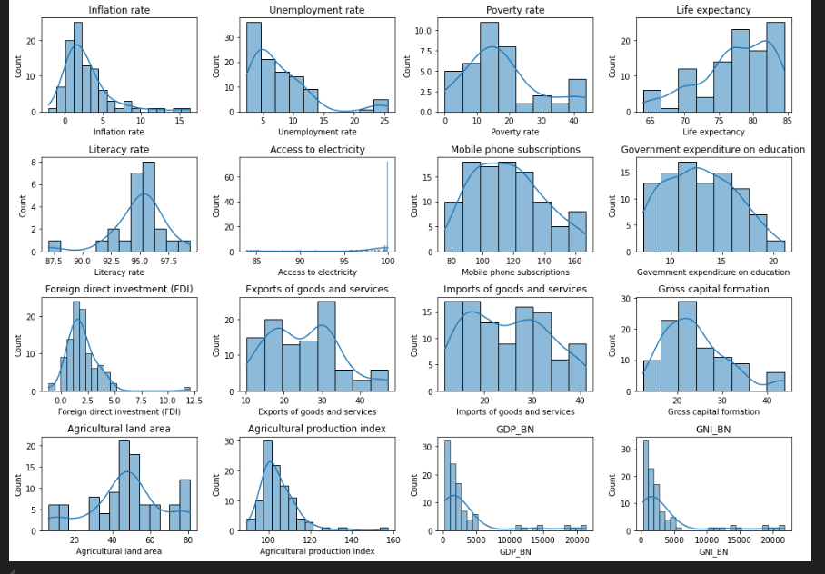
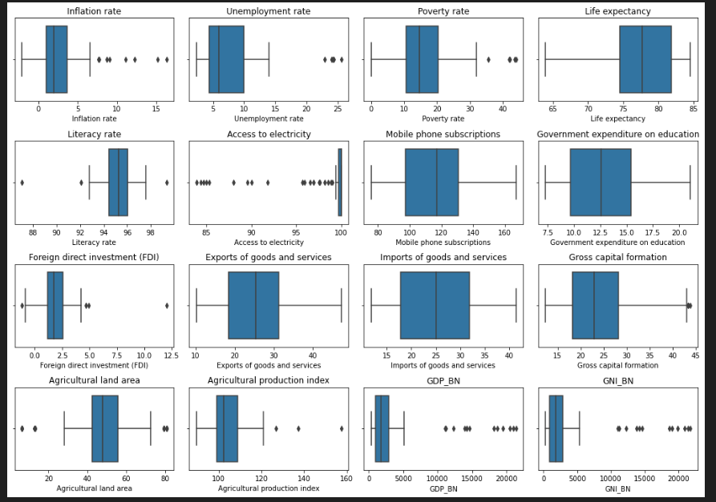

# 🌍 G20 Countries Economic & Social Insights Using World Bank API

## 🔍 Project Overview

This project analyzes key **economic and social indicators** across G20 countries using real-time data collected from the **World Bank API**.

Using Python, I automated the extraction, cleaning, and analysis of indicators such as **GDP per capita**, **life expectancy**, **CO₂ emissions**, **education levels**, and **sanitation access**. The goal is to uncover development patterns, identify regional disparities, and generate insights that support data-driven decision-making.

---

## 🛠️ Tools & Libraries Used

- Python  
- Pandas  
- wbdata (World Bank API)  
- Matplotlib  
- Seaborn  
- Jupyter Notebook

---

## 📌 Key Features

- ✅ Real-time data collection via World Bank API  
- 🧹 Data cleaning and transformation using Pandas  
- 📊 Exploratory Data Analysis (EDA) with visual insights  
- 🌐 Cross-country comparisons across key development indicators  
- 📈 Enables data-backed strategic understanding and trend discovery  

---

## 💼 Relevance to Real-World Roles

This project is valuable for multiple roles, including:

### 🔹 **Data Analyst**
- Demonstrates data wrangling, visualization, and storytelling  
- Focuses on trends, variance, and KPIs using real-world global data  

### 🔹 **Business Analyst**
- Analyzes how economic and social factors influence planning  
- Generates insights to support reports and business recommendations  

### 🔹 **Business Support / Functional Analyst**
- Simulates customer segmentation and geographic insight mapping  
- Demonstrates how user-related data drives product/service improvement  
- Shows ability to work with APIs and large datasets in a clean, structured way  

---

## 📸 Sample Visualizations

### 🔹 Histogram Distribution of Indicators  
Visualizing GDP, life expectancy, CO₂ emissions, and more.

### 🔹 Boxplot Summary of Country Indicators  
Boxplots reveal outliers and spread in economic/social data across countries.

---

## ✨ Project Outcomes

- Identified disparities in development across G20 nations  
- Analyzed patterns in health, environment, and education indicators  
- Built a reusable pipeline for development-focused analytics  
- Strengthened skills in API-based data sourcing and structured analysis  

---

## 📁 Dataset Source

Live data accessed via the [World Bank Open Data](https://data.worldbank.org/) using the `wbdata` Python package.

---

## 👩‍💻 Author

**Krina Patel**  
B.Tech in Computer Science | BS in Data Science & Applications  
Aspiring **Data Analyst**, **Business Analyst**, and **Support Specialist**  
📧 krinapatel0807@gmail.com  
[GitHub](https://github.com/krinapatel08)  
[LinkedIn](https://linkedin.com/in/krinap08)
